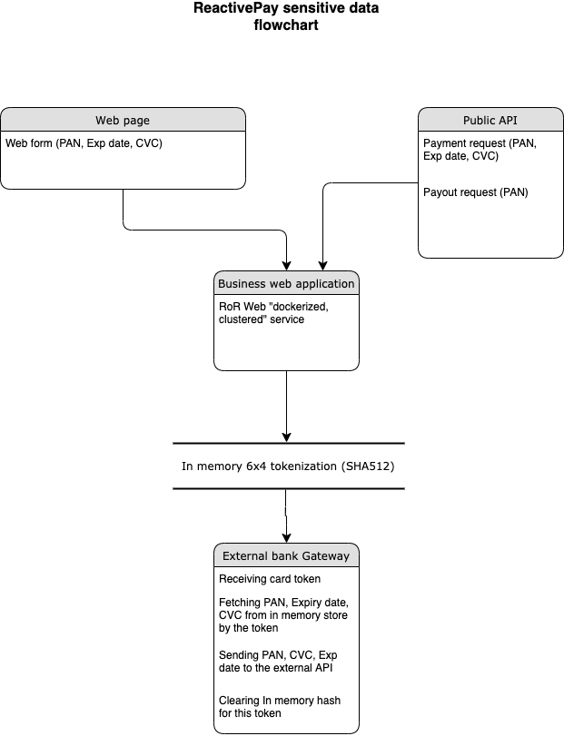

PCI DSS brief info
==================

Basic system information compiled for PCI DSS, audit use only

List of system components
-------------------------------

=================  ============================================= =======================
Name               Description                                   Type
=================  ============================================= =======================
business           Public payment API and checkout/payment form  RoR web-application
core               Financial ledger for the operations.          RoR web-application
business-sidekiq   Sidekiq job schedule for business web-service RoR application 
business_whenever  Service for business_sidekiq queues           RoR application 
core-whenever      Service for core_sidekiq queues               RoR application 
core-docs          Public Core API documentation (rst based)     RoR web-application
flexy-commission   Commission calculation application            Python app
flexy-guard        Payment filtering web-service                 Python app
flexy-guard-admin  Web interface and admin panel for flexy-guard Python web-app 
demo               Just few static pages for checkout demo       Python web-app
tests              Integration tests for all components          Python/Selenium web-app
metabase           Data analysis web application (reports)       Java web-application
wallet-web         Wallet web application                        RoR web-application
banking-web        Online banking web application                RoR web-application
settings           System and account settings                   RoR web-application
core-sidekiq       Sidekiq job schedule for core web-service     RoR application
business-docs      Public API documentation (rst based)          RoR web-application
minio              Static content local storage                  Java web-application
rate               Currency rate provider and cache              Python web-app
rate-admin         Web interface and admin panel for rate        Python web-app
card-storage       Encrypted persisten card-storage (not used)   RoR app
mongo-express      Web interface to manage MongoDB               NodeJS app
mongo              Mongo database for storing stats and rates    Mongo
postgres           PostgresDB - main data storage for            Postgres
                   core/business/settings apps                   
redis              In-memory data storage, using as fast cache   Redis
=================  ============================================= ======================= 

Sensitive data flow description
-------------------------------

Sensitive data objects
----------------------

- PAN (Card number)
- CVC/CVV code

Processing sensitive data components
------------------------------------

- Web page (accepting sensitive data object from the web-form and sending it over HTTPS POST to business web-service)
- Public API (accepting sensitive data object from the JSON API request over HTTPS POST and sending it to business web-service)
- Business web service accepts sensitive data and stores it in in-memory tokenized hash-table
- Generates (business web-service) token using card masked (sanetized) number (6x4)
- Posting (business web-service) it as hash {token: [sensitive data]} to in-memory hash table
- Interacts (business web-service) using this token with the following system components: flexy-guard service, internally within business web-service
- Retrieves (business web-service) using this token sensitive data from in-memory hash table and sends to the 3d party bank acquier or payment service provider's API
- Logs sanetized sensitive data (6x4 masekd card number) to InteractionLogs table in business web-service data-base
